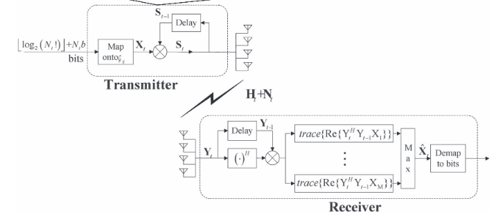
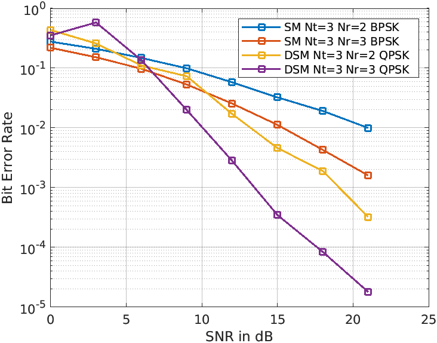

# Differential-Spatial-Modulation

Matlab Implementation of DSM
+ Transmitter
+ Receiver
+ Rayleigh Fading Channel
+ Simulation for Bit Error rate calculation

## Introduction
<p align="center">
  
</p>

In a recently developing modulation technique, Spatial modulation (SM), only a single antenna is activated during MIMO transmission. The major limitation associated with the SM is that channel state information (CSI) is required at the receiver end. Estimation of CSI makes the decoding process fairly complex and difficult to implement. In a recent trial to overcome the difficulties posed by SM, a differential SM scheme(DSM) is formulated that completely bypasses any CSI at the transmitter or receiver, while preserving the single active transmit antenna property. 

[PAPER](https://ieeexplore.ieee.org/document/6879496)

## How to use
1. ``` git clone ``` the repository.
2. ```DSM.m``` contains the Differential Spatial Modulation model
  a. Input: To be Transmitted message array, N<sub>t</sub>, N<sub>r</sub>, b, channel SNR
  b. Output: Recieved Message Array
3. ```BitErrorRate.m``` compares SM vs DSM techniques.

<p align="center">
  
</p>

## Results
We tried to replicate the results mentioned in the paper. The images represent some of the results similar to that of the paper itself. Due to limited time and compute, we generated results only for Nt, Nr <= 3.

## Dependencies
- Matlab

## Contributing 
Please feel free to create a Pull Request for any suggested improvements or error in the code. If you are a beginner, you can refer to [this](https://opensource.guide/how-to-contribute/) for getting started.

## Support
If you found this useful, please consider starring(★) the repo so that it can reach a broader audience.

## License
This project is licensed under the MIT License - see the [LICENSE](../master/LICENSE) file for details.
